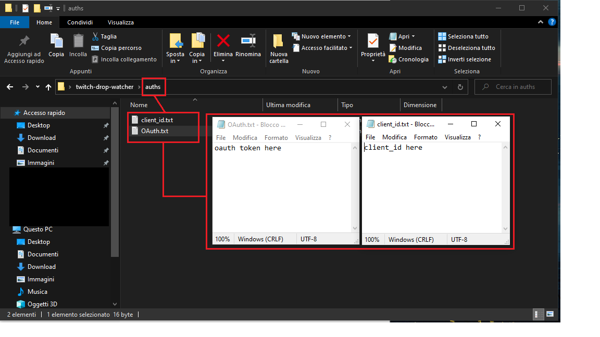
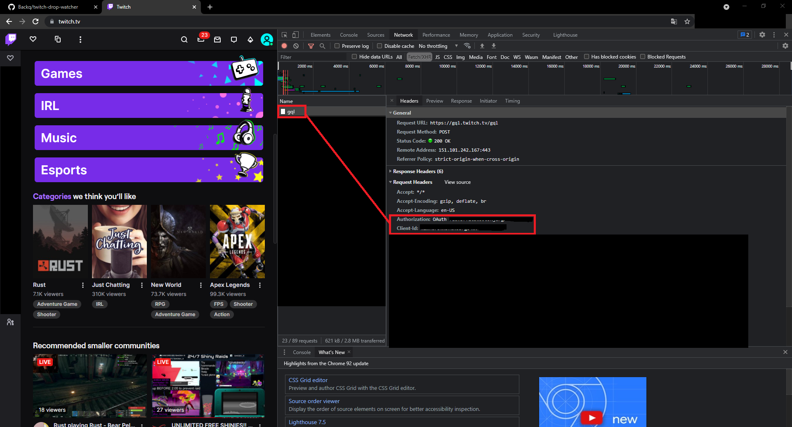

<h1 align="center">twitch.tv drop watcher</h1>

# Twitch.tv drops auto reclaimer
> This is a program for watch a stream and then reclaim automatically the drop from the stream using Selenium. I used this for Rust, as you can see into the source. You can filter your "own" games by adding the game's id into the "GameType.class".
> NOTE: Before using this source, you need to get your own client id and bearer token from twitch api, using your own account.
> There are no checks for ip so you can send request without put a proxy list.

<h2>How To Use</h2>

 Fill the txt files with your 'client_id' and 'OAuth token' as I explained below.
 
Don't forget to open 'chromedriver' before open the drop watcher.
 
!! CHROMEDRIVER MUST HAVE THE SAME VERSION AS GOOGLE CHROME !!

  

<h2>How to get "client_id" and "OAuth token"</h2>

 [1] Visit "twitch.tv" and log into your account.
 
[2] When you are into the home page, press F12, press on "Network" and then on "Fetch/XHR".
 
[3] Press on "gql" and then into 'Request Headers' you can see your client_id and OAuth token.
 
If you need help, contact me on Telegram: @Backq or Discord: Back#0003

  

